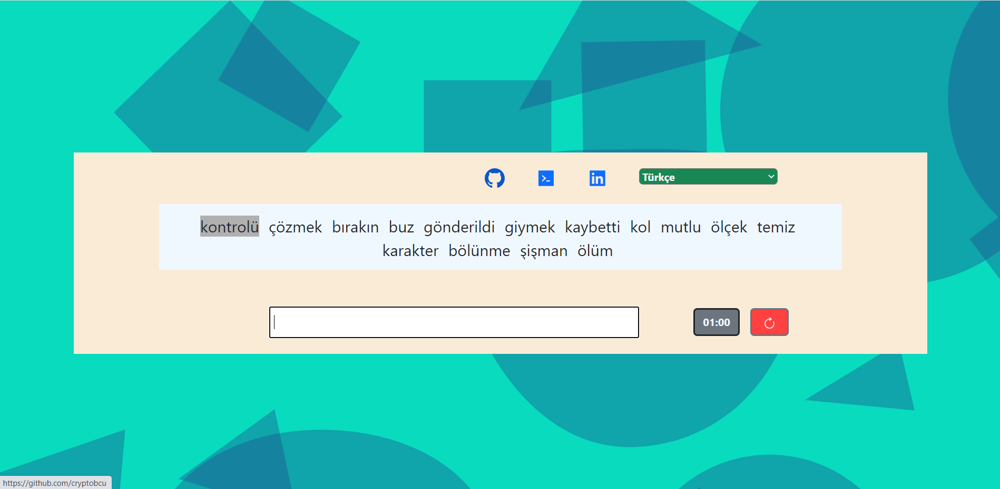

# Typing Speed App

A typing speed app that measures how many words you type correctly in 1 minute. Turkish and English language options are available.
[Live Demo](https://typing-speed-app-cryptobcu.netlify.app)

## Packages I use...

* @reduxjs/toolkit
* react-redux
* Bootstrap
* React Icons

---
Go to relevant directory and install dependencies with..
> npm install

then run the project with..
> npm run start

---
## Preview 
